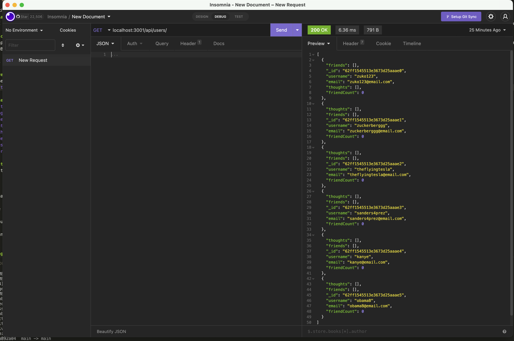

# Backend for a Social Networking App

## Description
This application functions as the back end for a social networking site. It's an API for a social network web application where users can share their thoughts, react to friends’ thoughts, and create a friend list. Built using Express.js for routing, a MongoDB database, and the Mongoose ODM. 

Here's the link to how it works: [click here](https://youtube.com/playlist?list=PLiAcGpnOWXwvV8faFy1mFmlxY0DaqWVdb).

## Screenshots
How the application looks on Insomnia:


# Table of Contents
* [Installation](#installation)
* [Usage](#usage)
* [License](#license)
* [Contributing](#contributing)
* [Technologies Used](#technologies-used)
* [Code Snippets](#code-snippets)
* [Questions](#questions)
* [User Information](#user-information)

## Installation
To install necessary dependencies, run the following command:
```
npm i
```
To create the database, run the following command:
```
npm run seed
```
To run the server, run the following command:
```
npm run dev
```

## Usage
Install the dependencies and you're ready to go.

## License 
This project is licensed under the MIT license.

## Contributing
Contact me.

## Technologies Used
- Node.js
- MongoDB
- Mongoose ODM
- Express
- Moment.js

## Code Snippets
```javascript
// Create thought based on user input sent through the request body
    createThought(req, res) {
        Thought.create(req.body)
            .then((thought) => {
                return User.findOneAndUpdate(
                    { _id: req.body.userId },
                    { $addToSet: { thoughts: thought._id } },
                    { new: true }
                );
            })
            .then((user) =>
                !user
                    ? res.status(404).json({
                        message: 'Thought created, but found no user with that ID',
                    })
                    : res.json('Created the thought 🎉')
            )
            .catch((err) => {
                res.status(500).json(err);
            });
    },
```
This is the functionality used to create a new thought and associate it to an existinng user. First, we want to instantiate a new 'thought' based on the model we have already created. Only after this has been successful, do we want to make sure there exists a user to associate it to. If there is, then we'll find this user based on the `userId` we received through the request's body, and add the new thought's id to our `thoughts` array in our user (this array holds pointers to the thoughts as id's). Using `{ new: true }` we are able to see this new change in our response. If this was successful, then we receive a message confirming the creation of the model and its association, or that the thought was created but no user was found based on the provided id.

## Questions
If you have any questions about the repo, open an issue or contact me directly at laura.sierra17@gmail.com.
You can find more of my work at [laurasierra17](https://www.github.com/laurasierra17).

## User Information
- [LinkedIn](https://www.linkedin.com/in/laurasierra2022)
- [Portfolio](http://www.laura-sierra.com)